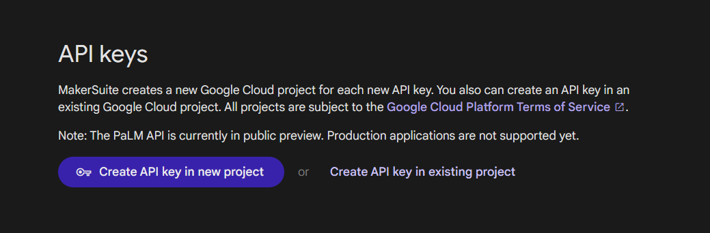

# CodebloomAI
CodebloomAI is a python PaLM2-based AI code generator and modifier application, allowing side by side coding and AI assistance.

### PaLM2
[PaLM2](https://github.com/google/generative-ai-docs/) is Google's AI lanuage model which drives conversational AI program [Google Bard](https://bard.google.com).

### Credits
Interface was developed using [TomSchimansky](https://github.com/TomSchimansky)'s [CustomTkinter](https://github.com/TomSchimansky/CustomTkinter).


## Setup
To play with CodebloomAI, you must get your own free API key from Google and place it in the configure file.

### Getting a key
Go to **➡️ https://makersuite.google.com/app/apikey**.


Select **Create API key in new project**.

Once generated, you will see a pop-up with your API key:


Select **Copy**.

*For your safety, please don't leak this key.*

### Embedding the key
In your clone/fork of the CodebloomAI repository, rename `config_template.py` to `config.py`. 

Then, open `config.py` with your IDE, and paste your key as a string in the `palm2_key` variable.

```python
# Your key for Google's PaLM2

palm2_key = "xxxxxxxxxxxxxxxxxxxxxxxxxxxxxx"
```
| *`config.py`*


## Required Installs
```
pip install -q google-generativeai
pip install tkinter
pip install customtkinter
pip install pyperclip
```
